<div align="center">


[](https://git.io/typing-svg)

### 아이디어를 빠르게 검증하고, 실제로 배포되는 제품으로 완성하는 빌더입니다.

<p>
  <a href="https://github.com/coding-jhj"></a>
  <a href="#-featured-projects"></a>
  <a href="#-tech-stack"></a>
  <a href="#-live-demos"></a>
</p>

</div>

---

## 👋 About Me

저는 **AI Agent, 온디바이스 AI, 데이터 제품, Android 앱, 웹 인터랙션**을 중심으로 프로젝트를 만드는 개발자입니다.  
단순히 코드를 작성하는 것에서 끝내지 않고, 사용자가 바로 열어볼 수 있는 **데모·대시보드·문서·배포 환경**까지 함께 만드는 것을 중요하게 생각합니다.

```text
문제 발견
  → 작은 MVP 설계
  → 핵심 기능 구현
  → 테스트 / 문서화
  → Hugging Face · Cloud Run · GitHub Pages 배포
  → 피드백 기반 개선
```

제가 특히 좋아하는 프로젝트는 다음과 같습니다.

- **근거를 남기는 AI Agent**: 단순 답변이 아니라, 어떤 파일과 라인을 보고 판단했는지 보여주는 Agent
- **현실 기기에서 동작하는 AI**: 서버에 모든 것을 보내지 않고, Android 기기 안에서 빠르게 추론하는 AI
- **데이터를 제품으로 바꾸는 대시보드**: 수집 → 정제 → 저장 → 시각화 → 자동 배포까지 이어지는 데이터 파이프라인
- **바로 실행되는 웹 경험**: 설치 없이 브라우저에서 열리는 게임, 교재, 인터랙티브 문서

---

## 🧭 Portfolio at a Glance

| Area | Representative Projects | What I Build |
|---|---|---|
| 🦮 Accessibility AI | [VoiceGuide](https://github.com/coding-jhj/VoiceGuide) | Android 온디바이스 객체 탐지, 한국어 TTS, 진동 피드백, 실시간 대시보드 |
| 🤖 AI Agents | [RepoPilot](https://github.com/coding-jhj/RepoPilot), [AI_AGENT](https://github.com/coding-jhj/AI_AGENT) | 저장소 분석 Agent, ReAct 검색 Agent, evidence 기반 분석, patch draft |
| 📊 Data Products | [Stelive_data](https://github.com/coding-jhj/Stelive_data) | API/스크래핑 수집, CSV/JSON 저장, GitHub Actions 자동화, Pages 대시보드 |
| 📚 Learning System | [Review-Estcamp-AI-Human](https://github.com/coding-jhj/Review-Estcamp-AI-Human), [weekdays_vacation_python](https://github.com/coding-jhj/weekdays_vacation_python) | Python 기초부터 Transformer/BERT까지 학습 정리, 실습 코드, 예제 기반 복습 |
| 🎮 Web Experience | [ARKAN_FORGOTTEN_THRONE](https://github.com/coding-jhj/ARKAN_FORGOTTEN_THRONE) | 단일 HTML 기반 픽셀 RPG, 월드맵, 파티 편성, 턴제 전투 |
| 🧰 Git Practice | [Remote-Git-Practice](https://github.com/coding-jhj/Remote-Git-Practice) | 원격 저장소, 협업 파일 정리, Git 기본 흐름 실습 |

---

## 🛠 Tech Stack

<div align="center">

### AI · Agent · ML
<p>
  
  
  
  
  
  
</p>

### Backend · API · Data
<p>
  
  
  
  
  
  
</p>

### App · Frontend · Deployment
<p>
  
  
  
  
  
  
  
  
  
</p>

</div>

---

## 🚀 Featured Projects

<table>
<tr>
<td width="50%" valign="top">

### 🦮 VoiceGuide

**시각장애인을 위한 온디바이스 AI 보행 보조 앱**

Android 카메라 프레임을 서버로 보내지 않고, 기기 내부에서 YOLO/TFLite로 장애물을 탐지합니다. 위험도에 따라 **진동·한국어 TTS·비프음**을 출력하고, 서버는 탐지 JSON과 GPS를 받아 실시간 대시보드와 공공데이터 기반 보행 시나리오를 제공합니다.

<p>
  <a href="https://github.com/coding-jhj/VoiceGuide"></a>
  <a href="https://voiceguide-1063164560758.asia-northeast3.run.app/dashboard"></a>
</p>

**Keywords**: Android, Kotlin, CameraX, TFLite, YOLO, FastAPI, SSE, Public Data, Cloud Run

</td>
<td width="50%" valign="top">

### 🧭 RepoPilot

**무료 환경에서 동작하는 GitHub 저장소 분석 Agent MVP**

public GitHub 저장소를 clone하고, 코드를 인덱싱한 뒤, 관련 chunk 검색과 정적 분석 rule을 통해 **파일/라인 근거가 있는 finding**과 patch draft를 생성합니다. OpenAI/Claude/유료 DB 없이 동작하는 free-first 구조입니다.

<p>
  <a href="https://github.com/coding-jhj/RepoPilot"></a>
  <a href="https://jeonghwanju-repopilot.hf.space/"></a>
  <a href="https://coding-jhj.github.io/RepoPilot/"></a>
</p>

**Keywords**: FastAPI, Next.js, Python AST, Retrieval, Static Analysis, Patch Draft, Hugging Face

</td>
</tr>
<tr>
<td width="50%" valign="top">

### 🤖 AI Search Agent

**스스로 검색하고 판단하는 ReAct 기반 AI Agent**

질문을 받으면 검색이 필요한지 판단하고, DuckDuckGo 검색 결과를 관찰한 뒤 답변을 생성하는 Agent입니다. Gemini 2.0 Flash, LangChain ReAct, FastAPI, Hugging Face Spaces를 사용합니다.

<p>
  <a href="https://github.com/coding-jhj/AI_AGENT"></a>
  <a href="https://jeonghwanju-ai-search-agent.hf.space"></a>
</p>

**Keywords**: Gemini, LangChain, ReAct, DuckDuckGo, FastAPI, Docker, Hugging Face

</td>
<td width="50%" valign="top">

### 📊 StelLive Data Dashboard

**스텔라이브 멤버 데이터를 자동 수집·시각화하는 대시보드**

YouTube API와 CHZZK 데이터를 수집하고, 방송·음악·콜라보·팔로워·구독자·영상 데이터를 JSON/CSV로 정리합니다. GitHub Actions로 정기 수집하고 GitHub Pages로 대시보드를 배포합니다.

<p>
  <a href="https://github.com/coding-jhj/Stelive_data"></a>
  <a href="https://coding-jhj.github.io/Stelive_data/"></a>
</p>

**Keywords**: Python, YouTube API, CHZZK, CSV, JSON, GitHub Actions, GitHub Pages

</td>
</tr>
<tr>
<td width="50%" valign="top">

### 📚 AI 학습 교재

**Python 기초부터 Transformer · BERT까지 정리한 인터랙티브 HTML 교재**

이스트캠프 AI Human Camp 학습 내용을 하나의 HTML 교재로 정리했습니다. Python, NumPy, 통계/선형대수, 데이터 사이언스, 머신러닝, 딥러닝, CNN, NLP, Attention, Transformer, BERT까지 학습 로드맵을 제공합니다.

<p>
  <a href="https://github.com/coding-jhj/Review-Estcamp-AI-Human"></a>
  <a href="https://coding-jhj.github.io/Review-Estcamp-AI-Human/AI%20학습%20교재%20_%20coding-jhj%20완전판.html"></a>
</p>

**Keywords**: Python, NumPy, Pandas, scikit-learn, TensorFlow, NLP, BERT, HTML

</td>
<td width="50%" valign="top">

### ⚔️ Arkan: Forgotten Throne

**설치 없이 바로 플레이하는 단일 HTML 픽셀 RPG**

HTML/CSS/Vanilla JS로 만든 브라우저 RPG입니다. 월드맵, 마을, 길드, 상점, NPC, 파티 편성, 던전, 턴제 전투, 캐릭터 스탯, 도감 등 플레이 가능한 구조를 단일 HTML 파일 안에 담았습니다.

<p>
  <a href="https://github.com/coding-jhj/ARKAN_FORGOTTEN_THRONE"></a>
  <a href="https://coding-jhj.github.io/ARKAN_FORGOTTEN_THRONE/ARKAN-FORGOTTEN-THRONE.html"></a>
</p>

**Keywords**: HTML5, CSS3, Vanilla JavaScript, Game Logic, Pixel UI, GitHub Pages

</td>
</tr>
</table>

---

## 📦 Public Repository Map

| Repository | Type | 핵심 내용 |
|---|---|---|
| [VoiceGuide](https://github.com/coding-jhj/VoiceGuide) | Accessibility AI App | 온디바이스 객체 탐지, Android TTS/진동 안내, FastAPI 서버, Cloud Run 대시보드 |
| [RepoPilot](https://github.com/coding-jhj/RepoPilot) | AI Agent / Code Analysis | public repo clone, code indexing, retrieval, static rule, evidence-backed finding, patch draft |
| [AI_AGENT](https://github.com/coding-jhj/AI_AGENT) | AI Search Agent | ReAct loop, Gemini, DuckDuckGo search, LangChain, FastAPI, Hugging Face 배포 |
| [Stelive_data](https://github.com/coding-jhj/Stelive_data) | Data Dashboard | YouTube/CHZZK 데이터 수집, JSON/CSV 저장, GitHub Actions 자동화, Pages 대시보드 |
| [Review-Estcamp-AI-Human](https://github.com/coding-jhj/Review-Estcamp-AI-Human) | Learning Textbook | Python부터 Transformer/BERT까지 정리한 인터랙티브 HTML 학습 교재 |
| [ARKAN_FORGOTTEN_THRONE](https://github.com/coding-jhj/ARKAN_FORGOTTEN_THRONE) | Browser Game | 단일 HTML RPG, 월드맵, 던전, 파티, 턴제 전투, GitHub Pages 플레이 |
| [weekdays_vacation_python](https://github.com/coding-jhj/weekdays_vacation_python) | Python Practice | Python 기초 문법, 패키지/import 구조, 함수 분리, 간단한 데이터 조회 실습 |
| [Remote-Git-Practice](https://github.com/coding-jhj/Remote-Git-Practice) | Git Practice | 원격 저장소 실습, 협업 파일 정리, Git 기본 흐름 기록 |
| [coding-jhj](https://github.com/coding-jhj/coding-jhj) | Profile README | 이 프로필 README와 포트폴리오 허브 |

---

## 🧩 How I Think About Building

```mermaid
flowchart LR
    A[Problem] --> B[MVP Scope]
    B --> C[Core Feature]
    C --> D[Evidence / Logs / Tests]
    D --> E[Deploy]
    E --> F[README & Demo]
    F --> G[Improve]

    style A fill:#0ea5e9,color:#fff,stroke:none
    style B fill:#6366f1,color:#fff,stroke:none
    style C fill:#8b5cf6,color:#fff,stroke:none
    style D fill:#14b8a6,color:#fff,stroke:none
    style E fill:#22c55e,color:#fff,stroke:none
    style F fill:#f97316,color:#fff,stroke:none
    style G fill:#ec4899,color:#fff,stroke:none
```



### 제가 중요하게 보는 기준

| 기준 | 설명 |
|---|---|
| 실제 동작 | README만 멋있는 프로젝트보다, 사용자가 눌러볼 수 있는 데모를 선호합니다. |
| 근거 중심 | AI가 말한 결과에 파일, 라인, 데이터, 로그 같은 근거가 남아야 한다고 생각합니다. |
| 개인정보 보호 | 가능한 경우 추론을 기기 안에서 처리하고, 서버에는 필요한 최소 데이터만 보냅니다. |
| 자동화 | 수집, 테스트, 배포를 반복 가능한 형태로 만들어 관리 비용을 줄입니다. |
| 문서화 | 다른 사람이 프로젝트의 의도와 구조를 빠르게 이해할 수 있도록 README와 해설 문서를 정리합니다. |

---

## 🌐 Live Demos

| Demo | Link | Platform |
|---|---:|---|
| 🦮 VoiceGuide Dashboard | [Open](https://voiceguide-1063164560758.asia-northeast3.run.app/dashboard) | Google Cloud Run |
| 🧭 RepoPilot | [Open](https://jeonghwanju-repopilot.hf.space/) | Hugging Face Spaces |
| 🤖 AI Search Agent | [Open](https://jeonghwanju-ai-search-agent.hf.space) | Hugging Face Spaces |
| 📊 StelLive Data Dashboard | [Open](https://coding-jhj.github.io/Stelive_data/) | GitHub Pages |
| 📚 AI 학습 교재 | [Open](https://coding-jhj.github.io/Review-Estcamp-AI-Human/AI%20학습%20교재%20_%20coding-jhj%20완전판.html) | GitHub Pages |
| ⚔️ Arkan RPG | [Play](https://coding-jhj.github.io/ARKAN_FORGOTTEN_THRONE/ARKAN-FORGOTTEN-THRONE.html) | GitHub Pages |

---

## 📈 GitHub Stats

<div align="center">


<br />
<br />


</div>

---

## 🧪 Current Direction

요즘은 다음 주제에 특히 관심이 많습니다.

```text
AI Agent
  - 근거 기반 repository 분석
  - retrieval + static analysis + patch draft
  - LLM 없이도 설명 가능한 agent workflow

On-Device AI
  - Android CameraX + TFLite 추론
  - 개인정보를 보호하는 edge inference
  - 음성/TTS/진동 기반 접근성 UX

Data Product
  - public data + API + scraping
  - 자동 수집과 대시보드 배포
  - 데이터 기반 의사결정 시나리오
```

---

## 🧑‍💻 Recommended Starting Points

처음 방문했다면 아래 순서로 보면 좋습니다.

1. **실전형 AI + Android + 서버 + 데이터**를 보고 싶다면 → [VoiceGuide](https://github.com/coding-jhj/VoiceGuide)
2. **AI Agent 아키텍처와 저장소 분석 흐름**을 보고 싶다면 → [RepoPilot](https://github.com/coding-jhj/RepoPilot)
3. **ReAct 검색 Agent를 빠르게 체험**하고 싶다면 → [AI Search Agent](https://github.com/coding-jhj/AI_AGENT)
4. **데이터 수집 자동화와 대시보드**를 보고 싶다면 → [Stelive_data](https://github.com/coding-jhj/Stelive_data)
5. **학습 정리와 AI 커리큘럼 흐름**을 보고 싶다면 → [AI 학습 교재](https://github.com/coding-jhj/Review-Estcamp-AI-Human)

---

<div align="center">

### Thanks for visiting 👋

작게 만들고, 끝까지 연결하고, 실제로 배포하는 개발자가 되기 위해 계속 기록하고 있습니다.

<br />

<a href="https://github.com/coding-jhj?tab=repositories">
  
</a>


</div>
