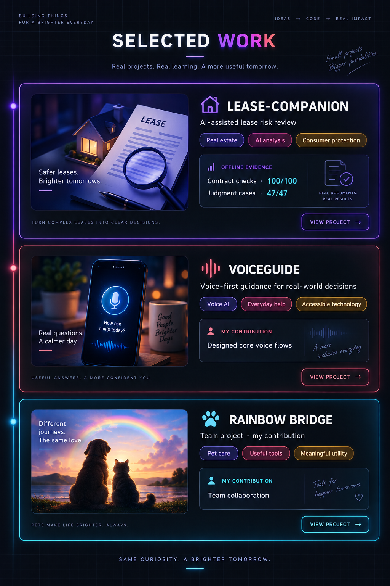
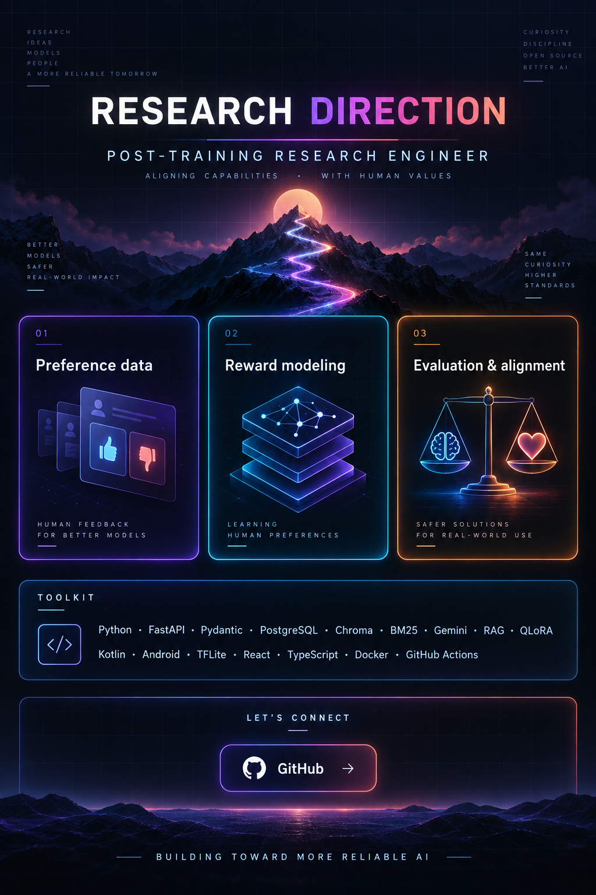

  

  <a href="#selected-work">Selected Work</a> ·
  <a href="#research-direction">Research Direction</a> ·
  <a href="#more-work">More Work</a>

  

  <a href="https://github.com/coding-jhj/Lease-Companion">Lease-Companion</a> ·
  <a href="https://github.com/coding-jhj/VoiceGuide">VoiceGuide</a> ·
  <a href="https://github.com/mosejong/Rainbow-Bridge/tree/jeonghwanju">Rainbow Bridge contribution branch</a>

  
<strong>Project details and evidence</strong>

  <h3>Lease-Companion · Team Lead, AI/LLM</h3>

  
<strong>Awarded contract analysis assistant | Team Lead, AI/LLM</strong>

  
A contract review assistant for first-time tenants. It combines document extraction,
  cross-document validation, official-source retrieval, and a Python rule engine to provide
  evidence-backed questions and actions instead of unsafe legal or safety claims.

  
<strong>Offline evidence:</strong> <code>Contract checks · 100/100</code> · <code>Judgment cases · 47/47</code> 
  Fixed offline test data; not real-world contract coverage.

  
<code>Document AI</code> <code>Rule Engine</code> <code>RAG</code> <code>Privacy</code> <code>Evaluation</code>

  

    <a href="https://github.com/coding-jhj/Lease-Companion">Repository</a> ·
    <a href="https://github.com/coding-jhj/Lease-Companion/blob/main/docs/ai/evaluation-plan.md">Evaluation Plan</a>
  

  <h3>VoiceGuide · On-device AI and accessibility</h3>

  
<strong>Walking assistant for blind and low-vision users</strong>

  
An Android system that runs YOLO/TFLite obstacle detection on device camera frames,
  then delivers stable risk-aware haptic feedback, Korean TTS, and audio cues. The system
  connects FastAPI, GPS events, SSE, and a Cloud Run dashboard without sending raw frames
  to the server.

  
<code>Android</code> <code>Kotlin</code> <code>TFLite</code> <code>YOLO</code> <code>FastAPI</code> <code>Accessibility</code>

  
<a href="https://github.com/coding-jhj/VoiceGuide">Repository</a>

  <h3>Rainbow Bridge · AI infrastructure contributor</h3>

  
<strong>Contribution branch: <code>jeonghwanju</code></strong>

  
Contributed to Qwen3 GPU TTS with asynchronous execution, tone mapping,
  STT/Gemini evaluation, recovery scoring, backend TTS and timeline flows,
  PM2 operations, and the demo video generation pipeline.

  
<code>Qwen3 TTS</code> <code>GPU Service</code> <code>Evaluation</code> <code>PM2</code> <code>Backend</code>

  
<a href="https://github.com/mosejong/Rainbow-Bridge/tree/jeonghwanju">Contribution Branch</a>

  

  <a href="https://github.com/coding-jhj"><strong>Open GitHub profile →</strong></a>

  
<strong>Research direction details</strong>

  <h3>Post-training Research Engineer</h3>

  
Building the research engineering foundation needed to make model behavior measurable,
  reproducible, and useful in real products.

  <h3><a href="https://github.com/coding-jhj/foundation-model-lab">foundation-model-lab</a></h3>

  
Reproducible decoder-only language model experiments covering tokenizers,
  causal self-attention, compact Transformers, checkpoints, validation loss,
  generation, and experiment records.

  
<strong>This is a foundation for research engineering and pre-training work, not a claim of completed post-training results.</strong>

  <h3><a href="https://github.com/coding-jhj/MY_CAREER_PLANNER">MY_CAREER_PLANNER</a></h3>

  
A Plan → Do → See workspace for research goals, execution logs, reviews,
  and measurable next experiments. It documents my preparation for
  <strong>Post-training Research Engineer</strong> work.

  <h3>Local-model direction</h3>

  
Lease-Companion contains an optional 7B 4-bit QLoRA comparison track. The current
  repository contains preprocessing, configuration, and evaluation scaffolding;
  <strong>no trained weights or checkpoint are presented as completed results.</strong>

  
<strong>More work, toolkit, and all public repositories</strong>

  <h2>Toolkit</h2>

  

    <code>Python</code> <code>FastAPI</code> <code>Pydantic</code> <code>PostgreSQL</code> <code>Chroma</code> <code>BM25</code> <code>Gemini</code> <code>RAG</code> <code>QLoRA</code> 
    <code>Kotlin</code> <code>Android</code> <code>TFLite</code> <code>React</code> <code>TypeScript</code> <code>Docker</code> <code>GitHub Actions</code>
  

  <h2>Independent Work</h2>

  <ul>
    <li><strong><a href="https://github.com/coding-jhj/RepoPilot">RepoPilot</a></strong>: evidence-grounded repository analysis agent producing file-and-line findings, static-analysis results, and patch drafts. <a href="https://jeonghwanju-repopilot.hf.space/">Demo</a> · <a href="https://coding-jhj.github.io/RepoPilot/repopilot-code-guide.html">Code Guide</a></li>
    <li><strong><a href="https://github.com/coding-jhj/Personal-AI-Studio">Personal-AI-Studio</a></strong>: source-grounded personal AI workspace with citation cards and local retrieval fallback. <a href="https://jeonghwanju-personal-ai-studio.hf.space">Demo</a></li>
    <li><strong><a href="https://github.com/coding-jhj/AI_AGENT">AI_AGENT</a></strong>: ReAct web-search agent using Gemini, LangChain, DuckDuckGo, FastAPI, and Hugging Face Spaces. <a href="https://jeonghwanju-ai-search-agent.hf.space">Demo</a></li>
    <li><strong><a href="https://github.com/coding-jhj/Stelive_data">Stelive_data</a></strong>: automated YouTube and CHZZK data pipeline with scheduled collection and a GitHub Pages dashboard. <a href="https://coding-jhj.github.io/Stelive_data/">Dashboard</a></li>
    <li><strong><a href="https://github.com/coding-jhj/claude-pwsh-kit">claude-pwsh-kit</a></strong>: MIT-licensed Claude Code harness for Windows and PowerShell with safety hooks, skill routing, regression tests, and subagent templates.</li>
    <li><strong><a href="https://github.com/coding-jhj/aleph-first-homework">aleph-first-homework</a></strong>: Passkey-based private portfolio using WebAuthn and Supabase PostgreSQL.</li>
    <li><strong><a href="https://github.com/coding-jhj/ALPEH_FIFTH_HOMEWORK">ALPEH_FIFTH_HOMEWORK</a> / <a href="https://github.com/coding-jhj/MINECRART_DASHBOARD">MINECRART_DASHBOARD</a></strong>: reliability-focused information dashboard with stale-data handling and replay fixtures.</li>
    <li><strong><a href="https://github.com/coding-jhj/ARKAN_FORGOTTEN_THRONE">ARKAN_FORGOTTEN_THRONE</a></strong>: playable single-file browser RPG. <a href="https://coding-jhj.github.io/ARKAN_FORGOTTEN_THRONE/">Play</a></li>
  </ul>

  <h2>All Public Repositories</h2>

  <h3>Profile and research</h3>

  <ul>
    <li><a href="https://github.com/coding-jhj">coding-jhj</a>: profile README and portfolio hub</li>
    <li><a href="https://github.com/coding-jhj/foundation-model-lab">foundation-model-lab</a>: language-model research lab</li>
    <li><a href="https://github.com/coding-jhj/Lease-Companion">Lease-Companion</a>: contract analysis assistant</li>
    <li><a href="https://github.com/coding-jhj/MY_CAREER_PLANNER">MY_CAREER_PLANNER</a>: research engineering workflow</li>
    <li><a href="https://github.com/coding-jhj/RepoPilot">RepoPilot</a>: repository analysis agent</li>
    <li><a href="https://github.com/coding-jhj/AI_AGENT">AI_AGENT</a>: ReAct search agent</li>
    <li><a href="https://github.com/coding-jhj/Personal-AI-Studio">Personal-AI-Studio</a>: source-grounded AI workspace</li>
  </ul>

  <h3>Data, product, and engineering</h3>

  <ul>
    <li><a href="https://github.com/coding-jhj/VoiceGuide">VoiceGuide</a>: on-device accessibility AI</li>
    <li><a href="https://github.com/coding-jhj/Stelive_data">Stelive_data</a>: automated data dashboard</li>
    <li><a href="https://github.com/coding-jhj/MINECRART_DASHBOARD">MINECRART_DASHBOARD</a>: reliability-focused dashboard</li>
    <li><a href="https://github.com/coding-jhj/ALPEH_FIFTH_HOMEWORK">ALPEH_FIFTH_HOMEWORK</a>: fixture-driven data product</li>
    <li><a href="https://github.com/coding-jhj/claude-pwsh-kit">claude-pwsh-kit</a>: PowerShell AI development harness</li>
    <li><a href="https://github.com/coding-jhj/aleph-first-homework">aleph-first-homework</a>: Passkey portfolio</li>
  </ul>

  <h3>Learning, creative work, and coursework</h3>

  <ul>
    <li><a href="https://github.com/coding-jhj/SKT_ALEPH_STUDY_NOTE">SKT_ALEPH_STUDY_NOTE</a>: infrastructure and systems study notes</li>
    <li><a href="https://github.com/coding-jhj/Review-Estcamp-AI-Human">Review-Estcamp-AI-Human</a>: interactive AI textbook</li>
    <li><a href="https://github.com/coding-jhj/AI-Career-OS">AI-Career-OS</a>: early career operating system</li>
    <li><a href="https://github.com/coding-jhj/ARKAN_FORGOTTEN_THRONE">ARKAN_FORGOTTEN_THRONE</a>: browser RPG</li>
    <li><a href="https://github.com/coding-jhj/aleph-ninth-homework">aleph-ninth-homework</a>: web coursework</li>
    <li><a href="https://github.com/coding-jhj/aleph-third-homework">aleph-third-homework</a>: web coursework</li>
    <li><a href="https://github.com/coding-jhj/alpeh-second-mini-game">alpeh-second-mini-game</a>: browser game coursework</li>
    <li><a href="https://github.com/coding-jhj/ALEPH_FIRST_HOMEWORK">ALEPH_FIRST_HOMEWORK</a>: web coursework</li>
  </ul>

  <h3>Archived practice</h3>

  <ul>
    <li><a href="https://github.com/coding-jhj/Remote-Git-Practice">Remote-Git-Practice</a>: Git practice record</li>
    <li><a href="https://github.com/coding-jhj/weekdays_vacation_python">weekdays_vacation_python</a>: Python learning record</li>
  </ul>

