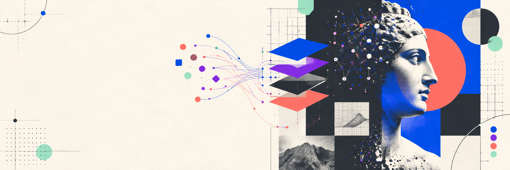

  

<table width="100%" cellpadding="14" cellspacing="0">
  <tr>
    <td valign="top" width="64%">
      <h1>Jeong Hwan Ju</h1>
      
<strong>Post-training Research Engineer</strong> 
      AI Engineer building toward post-training research.

      
I build evaluation-driven AI systems with grounded generation, 
      explicit safety boundaries, and deployment-aware engineering.

    </td>
    <td valign="top" width="36%">
      PORTFOLIO FOCUS 
      <code>Evaluation</code> <code>Grounding</code> <code>Deployment</code>
        
      PROOF POINTS 
      <strong>3</strong> team projects first 
      <strong>1</strong> award-winning lead project 
      <strong>8</strong> independent works
    </td>
  </tr>
</table>

  <a href="#selected-work">Selected Work</a> ·
  <a href="#research-direction">Research Direction</a> ·
  <a href="#independent-work">Independent Work</a> ·
  <a href="https://github.com/coding-jhj">GitHub</a>

| Direction | Recognition | Selected Work |
| --- | --- | --- |
| **Post-training Research Engineer** Research engineering preparation | **Minister of Employment and Labor Award** <a href="https://github.com/coding-jhj/Lease-Companion">Lease-Companion</a> · Team Lead, AI/LLM | **Lease-Companion** VoiceGuide · Rainbow Bridge |

## Selected Work

Three team projects first — each one shows a different way I turn AI systems into useful, testable products.

  

<table width="100%" cellpadding="16" cellspacing="0">
  <tr>
    <td valign="top" width="22%" align="center">
      
    </td>
    <td valign="top">
      <h3>Recognition · <a href="https://github.com/coding-jhj/Lease-Companion">Lease-Companion</a></h3>
      <strong>Awarded contract analysis assistant | Team Lead, AI/LLM</strong>
      
A contract review assistant for first-time tenants. It combines document extraction,
      cross-document validation, official-source retrieval, and a Python rule engine to provide
      evidence-backed questions and actions instead of unsafe legal or safety claims.

      

        STACK 
        <code>Document AI</code> <code>Rule Engine</code> <code>RAG</code> <code>Privacy</code> <code>Evaluation</code>
      

      

        <strong>Offline evidence:</strong>
        <code>Contract checks · 100/100</code> ·
        <code>Judgment cases · 47/47</code> 
        Fixed offline test data; not real-world contract coverage.
      

      

        <a href="https://github.com/coding-jhj/Lease-Companion">Repository</a> ·
        <a href="https://github.com/coding-jhj/Lease-Companion/blob/main/docs/ai/evaluation-plan.md">Evaluation Plan</a>
      

    </td>
  </tr>
</table>

<table width="100%" cellpadding="16" cellspacing="0">
  <tr>
    <td valign="top" width="22%" align="center">
      
    </td>
    <td valign="top">
      <h3>On-device AI · <a href="https://github.com/coding-jhj/VoiceGuide">VoiceGuide</a></h3>
      <strong>Walking assistant for blind and low-vision users</strong>
      
An Android system that runs YOLO/TFLite obstacle detection on device camera frames,
      then delivers stable risk-aware haptic feedback, Korean TTS, and audio cues. The system
      connects FastAPI, GPS events, SSE, and a Cloud Run dashboard without sending raw frames
      to the server.

      

        STACK 
        <code>Android</code> <code>Kotlin</code> <code>TFLite</code> <code>YOLO</code> <code>FastAPI</code> <code>Accessibility</code>
      

      
<a href="https://github.com/coding-jhj/VoiceGuide">Repository</a>

    </td>
  </tr>
</table>

<table width="100%" cellpadding="16" cellspacing="0">
  <tr>
    <td valign="top" width="22%" align="center">
      
    </td>
    <td valign="top">
      <h3>AI Infrastructure · <a href="https://github.com/mosejong/Rainbow-Bridge/tree/jeonghwanju">Rainbow Bridge</a></h3>
      <strong>AI and infrastructure contributor | Contribution branch: <code>jeonghwanju</code></strong>
      
Contributed to Qwen3 GPU TTS with asynchronous execution, tone mapping,
      STT/Gemini evaluation, recovery scoring, backend TTS and timeline flows,
      PM2 operations, and the demo video generation pipeline.

      

        STACK 
        <code>Qwen3 TTS</code> <code>GPU Service</code> <code>Evaluation</code> <code>PM2</code> <code>Backend</code>
      

      
<a href="https://github.com/mosejong/Rainbow-Bridge/tree/jeonghwanju">Contribution Branch</a>

    </td>
  </tr>
</table>

## Research Direction

| Direction | Work | What it demonstrates |
| --- | --- | --- |
| **Foundation model lab** | **[foundation-model-lab](https://github.com/coding-jhj/foundation-model-lab)** | Reproducible decoder-only language model experiments covering tokenizers, causal self-attention, compact Transformers, checkpoints, validation loss, generation, and experiment records. **This is a foundation for research engineering and pre-training work, not a claim of completed post-training results.** |
| **Execution workspace** | **[MY_CAREER_PLANNER](https://github.com/coding-jhj/MY_CAREER_PLANNER)** | A Plan → Do → See workspace for research goals, execution logs, reviews, and measurable next experiments. It documents my preparation for **Post-training Research Engineer** work. |
| **Local-model direction** | **Lease-Companion comparison track** | An optional 7B 4-bit QLoRA comparison track. The current repository contains preprocessing, configuration, and evaluation scaffolding; **no trained weights or checkpoint are presented as completed results.** |

## Independent Work

개인 프로젝트는 아이디어 목록이 아니라, 분석·검색·보안·운영·실패 처리를 직접 구현한 기록입니다.

<table width="100%" cellpadding="14" cellspacing="8">
  <tr>
    <td valign="top" width="50%">
      CODE ANALYSIS · AGENT
      <h3><a href="https://github.com/coding-jhj/RepoPilot">RepoPilot</a></h3>
      
<strong>근거가 남는 저장소 분석 Agent</strong> 
      공개 GitHub URL을 받아 파일을 인덱싱하고 Python·JavaScript·TypeScript 구조와 정적 규칙을 분석합니다. 결과에는 파일·라인 근거, 패치 초안, 범위 검증, 선택적 PR 흐름이 함께 남습니다.

      
<code>FastAPI</code> <code>Next.js</code> <code>Static Analysis</code> <code>Evidence</code>

      
<a href="https://jeonghwanju-repopilot.hf.space/">Demo</a> · <a href="https://coding-jhj.github.io/RepoPilot/repopilot-code-guide.html">Code Guide</a>

    </td>
    <td valign="top" width="50%">
      PERSONAL KNOWLEDGE · RAG
      <h3><a href="https://github.com/coding-jhj/Personal-AI-Studio">Personal-AI-Studio</a></h3>
      
<strong>출처가 보이는 개인 AI 워크스페이스</strong> 
      문서·코드·노트북·엑셀·사진 메타데이터·MongoDB를 하나의 지식 베이스로 묶습니다. 로컬 검색 결과를 출처 카드로 보여주고, 음성 입력과 외부 LLM 실패 시 로컬 fallback까지 연결했습니다.

      
<code>Streamlit</code> <code>TF-IDF</code> <code>Voice</code> <code>Fallback</code>

      
<a href="https://jeonghwanju-personal-ai-studio.hf.space">Demo</a>

    </td>
  </tr>
  <tr>
    <td valign="top" width="50%">
      WEB SEARCH · REACT LOOP
      <h3><a href="https://github.com/coding-jhj/AI_AGENT">AI_AGENT</a></h3>
      
<strong>검색이 필요한지 스스로 판단하는 Agent</strong> 
      질문을 분석해 검색 여부를 결정하고, DuckDuckGo 결과를 관찰한 뒤 추가 검색 또는 답변으로 이어지는 ReAct 흐름을 구현했습니다. FastAPI API와 브라우저 UI를 함께 제공하며 사용자가 넣은 키는 서버에 저장하지 않습니다.

      
<code>Gemini</code> <code>LangChain</code> <code>DuckDuckGo</code> <code>FastAPI</code>

      
<a href="https://jeonghwanju-ai-search-agent.hf.space">Demo</a>

    </td>
    <td valign="top" width="50%">
      DATA PIPELINE · OPERATIONS
      <h3><a href="https://github.com/coding-jhj/Stelive_data">Stelive_data</a></h3>
      
<strong>수집부터 배포까지 이어지는 데이터 제품</strong> 
      YouTube Data API와 CHZZK 데이터를 정기 수집하고 JSON·CSV 이력을 쌓은 뒤, 대시보드를 다시 생성해 GitHub Pages에 배포합니다. 외부 소스가 달라도 반복 실행되는 운영 흐름을 한 저장소에 담았습니다.

      
<code>Python</code> <code>GitHub Actions</code> <code>JSON/CSV</code> <code>GitHub Pages</code>

      
<a href="https://coding-jhj.github.io/Stelive_data/">Dashboard</a>

    </td>
  </tr>
  <tr>
    <td valign="top" width="50%">
      DEVELOPER TOOLING · SAFETY
      <h3><a href="https://github.com/coding-jhj/claude-pwsh-kit">claude-pwsh-kit</a></h3>
      
<strong>Windows·PowerShell용 Claude Code 하네스</strong> 
      위험 명령 차단, 키워드 기반 skill routing, 연구 검증 안내, 8개 subagent 템플릿을 하나로 묶었습니다. 한국어 인코딩 문제와 PowerShell 파이프 문제를 문서화하고 회귀 테스트로 확인합니다.

      
<code>PowerShell</code> <code>Safety Hooks</code> <code>Skill Router</code> <code>MIT</code>

    </td>
    <td valign="top" width="50%">
      SECURITY · PASSWORDLESS AUTH
      <h3><a href="https://github.com/coding-jhj/aleph-first-homework">Passkey Private Portfolio</a></h3>
      
<strong>공개 포트폴리오와 private workspace를 한 서비스로 연결</strong> 
      WebAuthn passkey로 인증하고 Vercel API와 Supabase PostgreSQL을 통해 계정별 private 자료를 분리합니다. challenge 재사용 방지, 세션 보호, 계정 범위 검사, RLS까지 보안 경계를 코드와 증거 흐름으로 구성했습니다.

      
<code>WebAuthn</code> <code>Vercel</code> <code>Supabase</code> <code>RLS</code>

    </td>
  </tr>
  <tr>
    <td valign="top" width="50%">
      RELIABILITY · DATA PRODUCT
      <h3><a href="https://github.com/coding-jhj/ALPEH_FIFTH_HOMEWORK">오늘의 진짜 정보판</a></h3>
      
<strong>데이터가 안 올 때도 정직하게 설명하는 대시보드</strong> 
      <a href="https://github.com/coding-jhj/ALPEH_FIFTH_HOMEWORK">ALPEH_FIFTH_HOMEWORK</a>와 <a href="https://github.com/coding-jhj/MINECRART_DASHBOARD">MINECRART_DASHBOARD</a>에서 timeout·인증 거절·호출 제한·오프라인·형식 변경을 구분하고 마지막 정상값을 보존합니다. 실제 조회와 replay fixture가 같은 핵심 경로를 사용하며 9종 fixture로 실패와 회복을 확인합니다.

      
<code>Next.js</code> <code>TypeScript</code> <code>Supabase</code> <code>Replay</code>

      
<a href="https://t04-real-information-board.vercel.app">Demo</a>

    </td>
    <td valign="top" width="50%">
      CREATIVE ENGINEERING · BROWSER GAME
      <h3><a href="https://github.com/coding-jhj/ARKAN_FORGOTTEN_THRONE">ARKAN_FORGOTTEN_THRONE</a></h3>
      
<strong>브라우저에서 바로 플레이하는 턴제 RPG</strong> 
      월드맵·마을·길드·상점·NPC·던전·전투·도감·장비 강화 흐름을 정적 호스팅으로 연결했습니다. Canvas 픽셀 배경, 모듈 분리, 모바일 반응형, 전투·세이브·게이팅을 확인하는 헤드리스 QA까지 포함합니다.

      
<code>HTML/CSS/JS</code> <code>Canvas</code> <code>Responsive</code> <code>Playwright</code>

      
<a href="https://coding-jhj.github.io/ARKAN_FORGOTTEN_THRONE/">Play</a>

    </td>
  </tr>
</table>

## Toolkit

TOOLS 
<code>Python</code> <code>FastAPI</code> <code>Pydantic</code> <code>PostgreSQL</code> <code>Chroma</code> <code>BM25</code> <code>Gemini</code> <code>RAG</code> <code>QLoRA</code> 
<code>Kotlin</code> <code>Android</code> <code>TFLite</code> <code>React</code> <code>TypeScript</code> <code>Docker</code> <code>GitHub Actions</code>

## All Public Repositories

  
<strong>Explore all 23 public repositories</strong>

### Profile and research

- [coding-jhj](https://github.com/coding-jhj): profile README and portfolio hub
- [foundation-model-lab](https://github.com/coding-jhj/foundation-model-lab): language-model research lab
- [Lease-Companion](https://github.com/coding-jhj/Lease-Companion): contract analysis assistant
- [MY_CAREER_PLANNER](https://github.com/coding-jhj/MY_CAREER_PLANNER): research engineering workflow
- [RepoPilot](https://github.com/coding-jhj/RepoPilot): repository analysis agent
- [AI_AGENT](https://github.com/coding-jhj/AI_AGENT): ReAct search agent
- [Personal-AI-Studio](https://github.com/coding-jhj/Personal-AI-Studio): source-grounded AI workspace

### Data, product, and engineering

- [VoiceGuide](https://github.com/coding-jhj/VoiceGuide): on-device accessibility AI
- [Stelive_data](https://github.com/coding-jhj/Stelive_data): automated data dashboard
- [MINECRART_DASHBOARD](https://github.com/coding-jhj/MINECRART_DASHBOARD): reliability-focused dashboard
- [ALPEH_FIFTH_HOMEWORK](https://github.com/coding-jhj/ALPEH_FIFTH_HOMEWORK): fixture-driven data product
- [claude-pwsh-kit](https://github.com/coding-jhj/claude-pwsh-kit): PowerShell AI development harness
- [aleph-first-homework](https://github.com/coding-jhj/aleph-first-homework): Passkey portfolio

### Learning, creative work, and coursework

- [SKT_ALEPH_STUDY_NOTE](https://github.com/coding-jhj/SKT_ALEPH_STUDY_NOTE): infrastructure and systems study notes
- [Review-Estcamp-AI-Human](https://github.com/coding-jhj/Review-Estcamp-AI-Human): interactive AI textbook
- [AI-Career-OS](https://github.com/coding-jhj/AI-Career-OS): early career operating system
- [ARKAN_FORGOTTEN_THRONE](https://github.com/coding-jhj/ARKAN_FORGOTTEN_THRONE): browser RPG
- [aleph-ninth-homework](https://github.com/coding-jhj/aleph-ninth-homework): web coursework
- [aleph-third-homework](https://github.com/coding-jhj/aleph-third-homework): web coursework
- [alpeh-second-mini-game](https://github.com/coding-jhj/alpeh-second-mini-game): browser game coursework
- [ALEPH_FIRST_HOMEWORK](https://github.com/coding-jhj/ALEPH_FIRST_HOMEWORK): web coursework

### Archived practice

- [Remote-Git-Practice](https://github.com/coding-jhj/Remote-Git-Practice): Git practice record
- [weekdays_vacation_python](https://github.com/coding-jhj/weekdays_vacation_python): Python learning record

## Contact

<a href="https://github.com/coding-jhj">GitHub</a>
