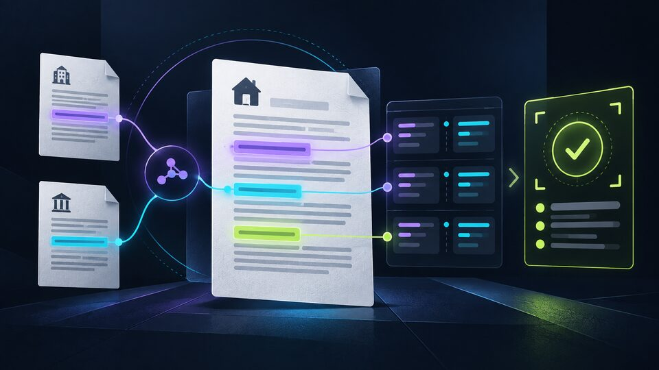
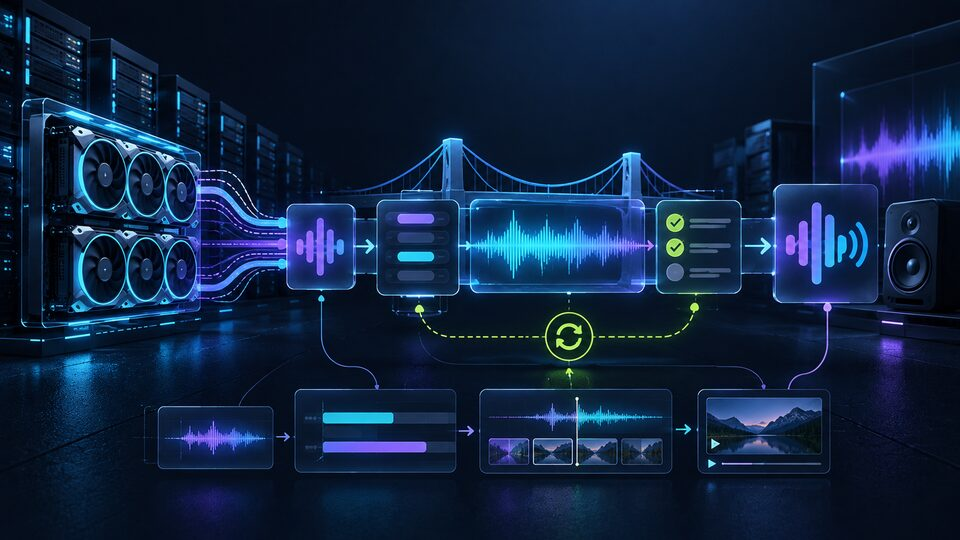
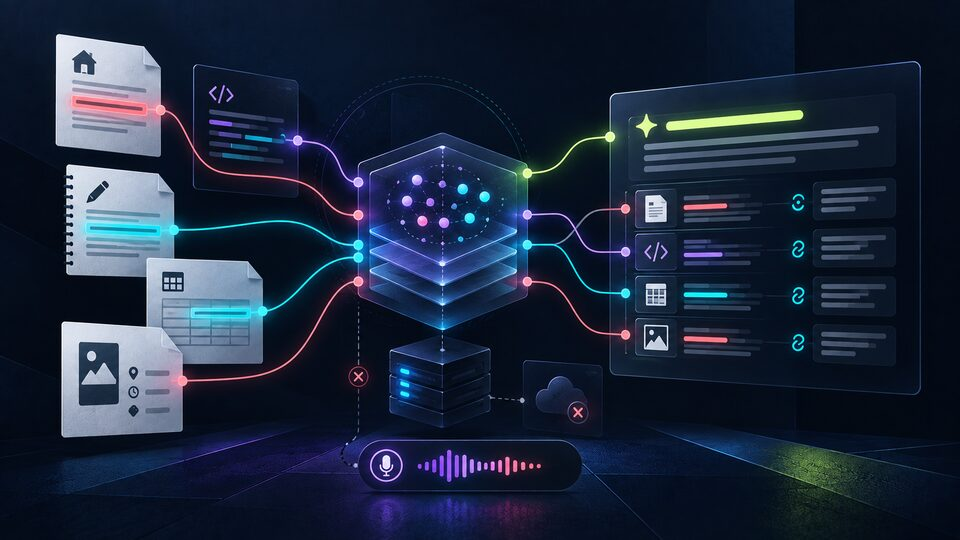
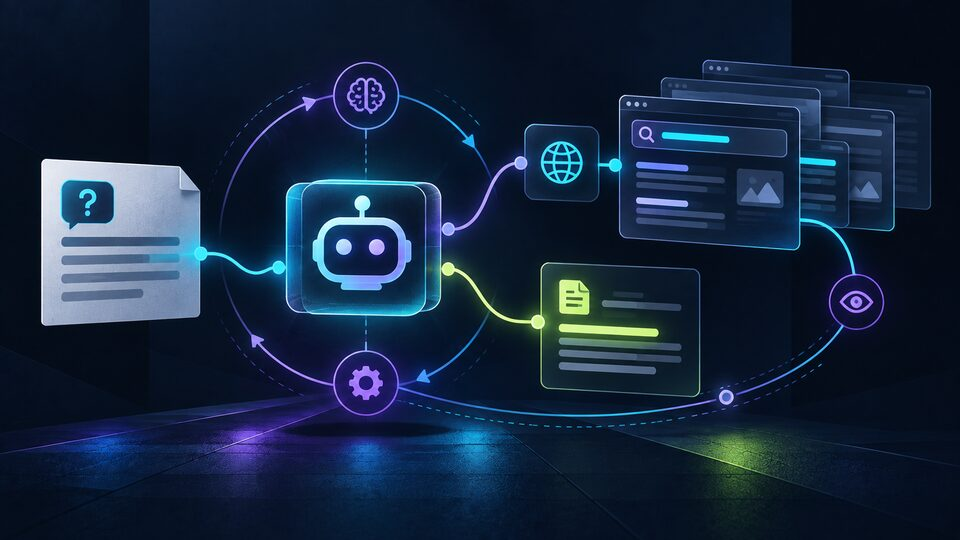
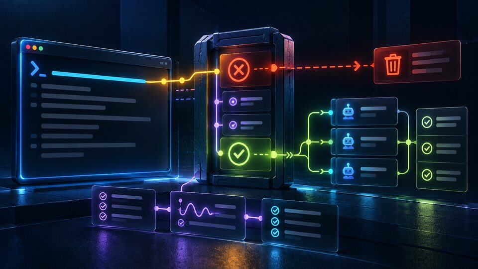

<table width="100%" cellpadding="18" cellspacing="0">
  <tr>
    <td valign="middle" width="58%">
      
<strong>AI SYSTEMS · EVALUATION · DEPLOYMENT</strong>

      <h1>Jeong Hwan Ju</h1>
      <h3>Post-training Research Engineer</h3>
      
Building evaluation-driven AI systems with grounded generation, explicit safety boundaries, and deployment-aware engineering.

    </td>
    <td valign="middle" width="42%" align="center">
      

      
<strong><a href="https://github.com/coding-jhj/Lease-Companion">Lease-Companion</a></strong> 
      Team Lead, AI/LLM 
      <strong>Minister of Employment and Labor Award</strong>

    </td>
  </tr>
</table>

---

## PROOF AT A GLANCE

  

| Direction | Recognition | Selected Work |
| --- | --- | --- |
| **Post-training Research Engineer** Research engineering preparation | **Minister of Employment and Labor Award** <a href="https://github.com/coding-jhj/Lease-Companion">Lease-Companion</a> · Team Lead, AI/LLM | **Lease-Companion** **VoiceGuide · Team Lead** · Rainbow Bridge |

---

## Selected Work

Three team projects first — each one shows a different way I turn AI systems into useful, testable products.

<table width="100%" cellpadding="16" cellspacing="0">
  <tr>
    <td valign="top" width="28%" align="center">
      
       CONTRACT / EVIDENCE
    </td>
    <td valign="top">
      <h3>Recognition · <a href="https://github.com/coding-jhj/Lease-Companion">Lease-Companion</a></h3>
      <strong>Awarded contract analysis assistant | Team Lead, AI/LLM</strong>
      
A contract review assistant for first-time tenants. It combines document extraction,
      cross-document validation, official-source retrieval, and a Python rule engine to provide
      evidence-backed questions and actions instead of unsafe legal or safety claims.

      

        STACK 
        <code>Document AI</code> <code>Rule Engine</code> <code>RAG</code> <code>Privacy</code> <code>Evaluation</code>
      

      

        <strong>Offline evidence:</strong>
        <code>Contract checks · 100/100</code> ·
        <code>Judgment cases · 47/47</code> 
        Fixed offline test data; not real-world contract coverage.
      

      

        <a href="https://github.com/coding-jhj/Lease-Companion">Repository</a> ·
        <a href="https://github.com/coding-jhj/Lease-Companion/blob/main/docs/ai/evaluation-plan.md">Evaluation Plan</a>
      

    </td>
  </tr>
</table>

<table width="100%" cellpadding="16" cellspacing="0">
  <tr>
    <td valign="top" width="28%" align="center">
      
       MOBILE / ACCESSIBILITY
    </td>
    <td valign="top">
      <h3>On-device AI · <a href="https://github.com/coding-jhj/VoiceGuide">VoiceGuide</a></h3>
      <strong>Team Lead · Walking assistant for blind and low-vision users</strong>
      
An Android system that runs YOLO/TFLite obstacle detection on device camera frames,
      then delivers stable risk-aware haptic feedback, Korean TTS, and audio cues. The system
      connects FastAPI, GPS events, SSE, and a Cloud Run dashboard without sending raw frames
      to the server.

      

        STACK 
        <code>Android</code> <code>Kotlin</code> <code>TFLite</code> <code>YOLO</code> <code>FastAPI</code> <code>Accessibility</code>
      

      
<a href="https://github.com/coding-jhj/VoiceGuide">Repository</a>

    </td>
  </tr>
</table>

<table width="100%" cellpadding="16" cellspacing="0">
  <tr>
    <td valign="top" width="28%" align="center">
      
       GPU / PIPELINE
    </td>
    <td valign="top">
      <h3>AI Infrastructure · <a href="https://github.com/mosejong/Rainbow-Bridge/tree/jeonghwanju">Rainbow Bridge</a></h3>
      <strong>AI and infrastructure contributor | Contribution branch: <code>jeonghwanju</code></strong>
      
Contributed to Qwen3 GPU TTS with asynchronous execution, tone mapping,
      STT/Gemini evaluation, recovery scoring, backend TTS and timeline flows,
      PM2 operations, and the demo video generation pipeline.

      

        STACK 
        <code>Qwen3 TTS</code> <code>GPU Service</code> <code>Evaluation</code> <code>PM2</code> <code>Backend</code>
      

      
<a href="https://github.com/mosejong/Rainbow-Bridge/tree/jeonghwanju">Contribution Branch</a>

    </td>
  </tr>
</table>

---

## Research Direction

| Direction | Work | What it demonstrates |
| --- | --- | --- |
| FOUNDATION MODEL LAB **Foundation model lab** | **[foundation-model-lab](https://github.com/coding-jhj/foundation-model-lab)** | Reproducible decoder-only language model experiments covering tokenizers, causal self-attention, compact Transformers, checkpoints, validation loss, generation, and experiment records. **This is a foundation for research engineering and pre-training work, not a claim of completed post-training results.** |
| 02 / EXECUTION WORKSPACE **Execution workspace** | **[MY_CAREER_PLANNER](https://github.com/coding-jhj/MY_CAREER_PLANNER)** | A Plan → Do → See workspace for research goals, execution logs, reviews, and measurable next experiments. It documents my preparation for **Post-training Research Engineer** work. |
| LOCAL-MODEL DIRECTION **Local-model direction** | **Lease-Companion comparison track** | An optional 7B 4-bit QLoRA comparison track. The current repository contains preprocessing, configuration, and evaluation scaffolding; **no trained weights or checkpoint are presented as completed results.** |

---

## Independent Work

Independent work is not a list of ideas. It is a record of implementing analysis, search, security, operations, and failure handling.

<table width="100%" cellpadding="16" cellspacing="8">
  <tr>
    <td valign="top" width="50%">
      

      CODE ANALYSIS · AGENT
      <h3><a href="https://github.com/coding-jhj/RepoPilot">RepoPilot</a></h3>
      
<strong>Evidence-grounded repository analysis agent</strong> 
      Accepts a public GitHub URL, indexes the files, and analyzes Python, JavaScript, and TypeScript structure with static rules. Results retain file-and-line evidence, patch drafts, scope validation, and an optional PR flow.

      
<code>FastAPI</code> <code>Next.js</code> <code>Static Analysis</code> <code>Evidence</code>

      
<a href="https://jeonghwanju-repopilot.hf.space/">Demo</a> · <a href="https://coding-jhj.github.io/RepoPilot/repopilot-code-guide.html">Code Guide</a>

    </td>
    <td valign="top" width="50%">
      

      PERSONAL KNOWLEDGE · RAG
      <h3><a href="https://github.com/coding-jhj/Personal-AI-Studio">Personal-AI-Studio</a></h3>
      
<strong>Source-grounded personal AI workspace</strong> 
      Unifies documents, code, notebooks, spreadsheets, photo metadata, and MongoDB into one knowledge base. It shows local retrieval results as source cards and connects voice input with a local fallback when an external LLM fails.

      
<code>Streamlit</code> <code>TF-IDF</code> <code>Voice</code> <code>Fallback</code>

      
<a href="https://jeonghwanju-personal-ai-studio.hf.space">Demo</a>

    </td>
  </tr>
  <tr>
    <td valign="top" width="50%">
      

      WEB SEARCH · REACT LOOP
      <h3><a href="https://github.com/coding-jhj/AI_AGENT">AI_AGENT</a></h3>
      
<strong>Agent that decides when search is needed</strong> 
      Analyzes a question, decides whether to search, observes DuckDuckGo results, and continues with another search or an answer through a ReAct loop. It provides a FastAPI API and browser UI without storing the user-provided key on the server.

      
<code>Gemini</code> <code>LangChain</code> <code>DuckDuckGo</code> <code>FastAPI</code>

      
<a href="https://jeonghwanju-ai-search-agent.hf.space">Demo</a>

    </td>
    <td valign="top" width="50%">
      

      DATA PIPELINE · OPERATIONS
      <h3><a href="https://github.com/coding-jhj/Stelive_data">Stelive_data</a></h3>
      
<strong>Data product from collection to deployment</strong> 
      Regularly collects YouTube Data API and CHZZK data, builds JSON and CSV history, regenerates the dashboard, and deploys it to GitHub Pages. The repository captures a repeatable operational flow across different external sources.

      
<code>Python</code> <code>GitHub Actions</code> <code>JSON/CSV</code> <code>GitHub Pages</code>

      
<a href="https://coding-jhj.github.io/Stelive_data/">Dashboard</a>

    </td>
  </tr>
  <tr>
    <td valign="top" width="50%">
      

      DEVELOPER TOOLING · SAFETY
      <h3><a href="https://github.com/coding-jhj/claude-pwsh-kit">claude-pwsh-kit</a></h3>
      
<strong>Claude Code harness for Windows and PowerShell</strong> 
      Combines dangerous-command blocking, keyword-based skill routing, research verification guidance, and eight subagent templates. It documents non-ASCII encoding and PowerShell pipe issues and checks them with regression tests.

      
<code>PowerShell</code> <code>Safety Hooks</code> <code>Skill Router</code> <code>MIT</code>

    </td>
    <td valign="top" width="50%">
      

      SECURITY · PASSWORDLESS AUTH
      <h3><a href="https://github.com/coding-jhj/aleph-first-homework">Passkey Private Portfolio</a></h3>
      
<strong>One service connecting a public portfolio and private workspace</strong> 
      Uses WebAuthn passkeys and separates account-scoped private data through a Vercel API and Supabase PostgreSQL. The security boundary covers challenge replay prevention, session protection, account-scope checks, and RLS.

      
<code>WebAuthn</code> <code>Vercel</code> <code>Supabase</code> <code>RLS</code>

    </td>
  </tr>
  <tr>
    <td valign="top" width="50%">
      

      RELIABILITY · DATA PRODUCT
      <h3><a href="https://github.com/coding-jhj/ALPEH_FIFTH_HOMEWORK">Real Information Board</a></h3>
      
<strong>A dashboard that explains failures honestly</strong> 
      <a href="https://github.com/coding-jhj/ALPEH_FIFTH_HOMEWORK">ALPEH_FIFTH_HOMEWORK</a> and <a href="https://github.com/coding-jhj/MINECRART_DASHBOARD">MINECRART_DASHBOARD</a> distinguish timeout, authentication rejection, rate limits, offline status, and schema changes while preserving the last known good value. Live requests and replay fixtures share the same core path, with nine fixtures covering failure and recovery.

      
<code>Next.js</code> <code>TypeScript</code> <code>Supabase</code> <code>Replay</code>

      
<a href="https://t04-real-information-board.vercel.app">Demo</a>

    </td>
    <td valign="top" width="50%">
      

      CREATIVE ENGINEERING · BROWSER GAME
      <h3><a href="https://github.com/coding-jhj/ARKAN_FORGOTTEN_THRONE">ARKAN_FORGOTTEN_THRONE</a></h3>
      
<strong>A turn-based RPG playable directly in the browser</strong> 
      Connects the world map, town, guild, shop, NPC, dungeon, battle, compendium, and equipment-upgrade flows through static hosting. It includes a Canvas pixel background, modular code, responsive mobile layout, and headless QA for battles, saves, and progression gates.

      
<code>HTML/CSS/JS</code> <code>Canvas</code> <code>Responsive</code> <code>Playwright</code>

      
<a href="https://coding-jhj.github.io/ARKAN_FORGOTTEN_THRONE/">Play</a>

    </td>
  </tr>
</table>

---

## Toolkit

TOOLS

<table width="100%" cellpadding="16" cellspacing="8">
  <tr>
    <td valign="top" width="50%">
      <code>Python</code> <code>FastAPI</code> <code>Pydantic</code> <code>PostgreSQL</code> <code>Chroma</code> <code>BM25</code> <code>Gemini</code> <code>RAG</code> <code>QLoRA</code>
    </td>
    <td valign="top" width="50%">
      <code>Kotlin</code> <code>Android</code> <code>TFLite</code> <code>React</code> <code>TypeScript</code> <code>Docker</code> <code>GitHub Actions</code>
    </td>
  </tr>
</table>

---

## All Public Repositories

  
<strong>Explore all 23 public repositories</strong>

### Profile and research

- [coding-jhj](https://github.com/coding-jhj): profile README and portfolio hub
- [foundation-model-lab](https://github.com/coding-jhj/foundation-model-lab): language-model research lab
- [Lease-Companion](https://github.com/coding-jhj/Lease-Companion): contract analysis assistant
- [MY_CAREER_PLANNER](https://github.com/coding-jhj/MY_CAREER_PLANNER): research engineering workflow
- [RepoPilot](https://github.com/coding-jhj/RepoPilot): repository analysis agent
- [AI_AGENT](https://github.com/coding-jhj/AI_AGENT): ReAct search agent
- [Personal-AI-Studio](https://github.com/coding-jhj/Personal-AI-Studio): source-grounded AI workspace

### Data, product, and engineering

- [VoiceGuide](https://github.com/coding-jhj/VoiceGuide): on-device accessibility AI
- [Stelive_data](https://github.com/coding-jhj/Stelive_data): automated data dashboard
- [MINECRART_DASHBOARD](https://github.com/coding-jhj/MINECRART_DASHBOARD): reliability-focused dashboard
- [ALPEH_FIFTH_HOMEWORK](https://github.com/coding-jhj/ALPEH_FIFTH_HOMEWORK): fixture-driven data product
- [claude-pwsh-kit](https://github.com/coding-jhj/claude-pwsh-kit): PowerShell AI development harness
- [aleph-first-homework](https://github.com/coding-jhj/aleph-first-homework): Passkey portfolio

### Learning, creative work, and coursework

- [SKT_ALEPH_STUDY_NOTE](https://github.com/coding-jhj/SKT_ALEPH_STUDY_NOTE): infrastructure and systems study notes
- [Review-Estcamp-AI-Human](https://github.com/coding-jhj/Review-Estcamp-AI-Human): interactive AI textbook
- [AI-Career-OS](https://github.com/coding-jhj/AI-Career-OS): early career operating system
- [ARKAN_FORGOTTEN_THRONE](https://github.com/coding-jhj/ARKAN_FORGOTTEN_THRONE): browser RPG
- [aleph-ninth-homework](https://github.com/coding-jhj/aleph-ninth-homework): web coursework
- [aleph-third-homework](https://github.com/coding-jhj/aleph-third-homework): web coursework
- [alpeh-second-mini-game](https://github.com/coding-jhj/alpeh-second-mini-game): browser game coursework
- [ALEPH_FIRST_HOMEWORK](https://github.com/coding-jhj/ALEPH_FIRST_HOMEWORK): web coursework

### Archived practice

- [Remote-Git-Practice](https://github.com/coding-jhj/Remote-Git-Practice): Git practice record
- [weekdays_vacation_python](https://github.com/coding-jhj/weekdays_vacation_python): Python learning record

---

## Contact

<a href="https://github.com/coding-jhj"><strong>↳ GitHub</strong></a>

