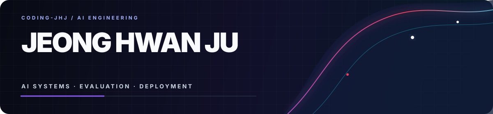
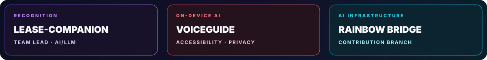

  

<table width="100%" cellpadding="22" cellspacing="0">
  <tr>
    <td align="center" bgcolor="#090D18">
      <h1>JEONG HWAN JU</h1>
      <h2>POST-TRAINING RESEARCH ENGINEER</h2>
      
I build evaluation-driven AI systems with grounded generation, 
      explicit safety boundaries, and deployment-aware engineering.

      

        EVALUATION
         · 
        GROUNDING
         · 
        DEPLOYMENT
      

    </td>
  </tr>
</table>

  <a href="#selected-work">Selected Work</a> ·
  <a href="#research-direction">Research Direction</a> ·
  <a href="#independent-work">Independent Work</a> ·
  <a href="https://github.com/coding-jhj">GitHub</a>

<table width="100%" cellpadding="18" cellspacing="0">
  <tr>
    <td valign="top" width="33%" bgcolor="#17112A">
      DIRECTION 
      <strong>Post-training Research Engineer</strong> 
      Research engineering preparation
    </td>
    <td valign="top" width="34%" bgcolor="#24121C">
      RECOGNITION 
      <strong>Minister of Employment and Labor Award</strong> 
      <a href="https://github.com/coding-jhj/Lease-Companion">Lease-Companion</a>
       · Team Lead, AI/LLM
    </td>
    <td valign="top" width="33%" bgcolor="#0C2430">
      FOCUS 
      <strong>Evaluation · Grounding · Deployment</strong> 
      Research with real constraints
    </td>
  </tr>
</table>

## Selected Work

Three team projects first — each one shows a different way I turn AI systems into useful, testable products.

  

<table width="100%" cellpadding="20" cellspacing="0">
  <tr>
    <td valign="top" width="22%" bgcolor="#26143A">
      RECOGNITION 
      <h3>LEASE-COMPANION</h3>
      TEAM LEAD · AI/LLM
    </td>
    <td valign="top" bgcolor="#101827">
      <strong>Awarded contract analysis assistant | Team Lead, AI/LLM</strong>
      
A contract review assistant for first-time tenants. It combines document extraction,
      cross-document validation, official-source retrieval, and a Python rule engine to provide
      evidence-backed questions and actions instead of unsafe legal or safety claims.

      CAPABILITIES 
      <code>Document AI</code> <code>Rule Engine</code> <code>RAG</code> <code>Privacy</code> <code>Evaluation</code>
      

        <strong>Offline evidence</strong> 
        Contract checks · 100/100
         · 
        Judgment cases · 47/47 
        Fixed offline test data; not real-world contract coverage.
      

      

        <a href="https://github.com/coding-jhj/Lease-Companion">Repository →</a> ·
        <a href="https://github.com/coding-jhj/Lease-Companion/blob/main/docs/ai/evaluation-plan.md">Evaluation Plan →</a>
      

    </td>
  </tr>
</table>

 

<table width="100%" cellpadding="20" cellspacing="0">
  <tr>
    <td valign="top" width="22%" bgcolor="#321827">
      ON-DEVICE AI 
      <h3>VOICEGUIDE</h3>
      ACCESSIBILITY · PRIVACY
    </td>
    <td valign="top" bgcolor="#111827">
      <strong>Walking assistant for blind and low-vision users</strong>
      
An Android system that runs YOLO/TFLite obstacle detection on device camera frames,
      then delivers stable risk-aware haptic feedback, Korean TTS, and audio cues. The system
      connects FastAPI, GPS events, SSE, and a Cloud Run dashboard without sending raw frames
      to the server.

      CAPABILITIES 
      <code>Android</code> <code>Kotlin</code> <code>TFLite</code> <code>YOLO</code> <code>FastAPI</code> <code>Accessibility</code>
      
<a href="https://github.com/coding-jhj/VoiceGuide">Repository →</a>

    </td>
  </tr>
</table>

 

<table width="100%" cellpadding="20" cellspacing="0">
  <tr>
    <td valign="top" width="22%" bgcolor="#0C2B36">
      AI INFRASTRUCTURE 
      <h3>RAINBOW BRIDGE</h3>
      CONTRIBUTION BRANCH
    </td>
    <td valign="top" bgcolor="#0E1B27">
      <strong>AI and infrastructure contributor | Branch: <code>jeonghwanju</code></strong>
      
Contributed to Qwen3 GPU TTS with asynchronous execution, tone mapping,
      STT/Gemini evaluation, recovery scoring, backend TTS and timeline flows,
      PM2 operations, and the demo video generation pipeline.

      CAPABILITIES 
      <code>Qwen3 TTS</code> <code>GPU Service</code> <code>Evaluation</code> <code>PM2</code> <code>Backend</code>
      
<a href="https://github.com/mosejong/Rainbow-Bridge/tree/jeonghwanju">Contribution Branch →</a>

    </td>
  </tr>
</table>

## Research Direction

<table width="100%" cellpadding="22" cellspacing="0">
  <tr>
    <td bgcolor="#17112A">
      CURRENT DIRECTION
      <h2>Post-training Research Engineer</h2>
      
I am building the research engineering foundation needed to make model behavior
      measurable, reproducible, and useful in real products.

    </td>
  </tr>
</table>

 

<table width="100%" cellpadding="18" cellspacing="0">
  <tr>
    <td valign="top" width="22%" bgcolor="#17223D">
      REPRODUCIBLE MODEL EXPERIMENTS
    </td>
    <td valign="top" bgcolor="#F8FAFC">
      <strong><a href="https://github.com/coding-jhj/foundation-model-lab">foundation-model-lab</a></strong>
      
Reproducible decoder-only language model experiments covering tokenizers,
      causal self-attention, compact Transformers, checkpoints, validation loss,
      generation, and experiment records.

      
<strong>This is a foundation for research engineering and pre-training work, not a claim of completed post-training results.</strong>

    </td>
  </tr>
  <tr>
    <td valign="top" bgcolor="#332717">
      EXECUTION WORKSPACE
    </td>
    <td valign="top" bgcolor="#FFFCF4">
      <strong><a href="https://github.com/coding-jhj/MY_CAREER_PLANNER">MY_CAREER_PLANNER</a></strong>
      
A Plan → Do → See workspace for research goals, execution logs, reviews,
      and measurable next experiments. It documents my preparation for
      <strong>Post-training Research Engineer</strong> work.

    </td>
  </tr>
  <tr>
    <td valign="top" bgcolor="#26143A">
      CURRENT EXPERIMENT TRACK
    </td>
    <td valign="top" bgcolor="#FBFAFF">
      <strong>Local-model direction</strong>
      
Lease-Companion contains an optional 7B 4-bit QLoRA comparison track. The current
      repository contains preprocessing, configuration, and evaluation scaffolding;
      <strong>no trained weights or checkpoint are presented as completed results.</strong>

    </td>
  </tr>
</table>

## Independent Work

  
<strong>Explore 8 supporting projects</strong>

- **[RepoPilot](https://github.com/coding-jhj/RepoPilot)**: evidence-grounded repository analysis agent producing file-and-line findings, static-analysis results, and patch drafts. [Demo](https://jeonghwanju-repopilot.hf.space/) | [Code Guide](https://coding-jhj.github.io/RepoPilot/repopilot-code-guide.html)
- **[Personal-AI-Studio](https://github.com/coding-jhj/Personal-AI-Studio)**: source-grounded personal AI workspace with citation cards and local retrieval fallback. [Demo](https://jeonghwanju-personal-ai-studio.hf.space)
- **[AI_AGENT](https://github.com/coding-jhj/AI_AGENT)**: ReAct web-search agent using Gemini, LangChain, DuckDuckGo, FastAPI, and Hugging Face Spaces. [Demo](https://jeonghwanju-ai-search-agent.hf.space)
- **[Stelive_data](https://github.com/coding-jhj/Stelive_data)**: automated YouTube and CHZZK data pipeline with scheduled collection and a GitHub Pages dashboard. [Dashboard](https://coding-jhj.github.io/Stelive_data/)
- **[claude-pwsh-kit](https://github.com/coding-jhj/claude-pwsh-kit)**: MIT-licensed Claude Code harness for Windows and PowerShell with safety hooks, skill routing, regression tests, and subagent templates.
- **[aleph-first-homework](https://github.com/coding-jhj/aleph-first-homework)**: Passkey-based private portfolio using WebAuthn and Supabase PostgreSQL.
- **[ALPEH_FIFTH_HOMEWORK](https://github.com/coding-jhj/ALPEH_FIFTH_HOMEWORK) / [MINECRART_DASHBOARD](https://github.com/coding-jhj/MINECRART_DASHBOARD)**: reliability-focused information dashboard with stale-data handling and replay fixtures.
- **[ARKAN_FORGOTTEN_THRONE](https://github.com/coding-jhj/ARKAN_FORGOTTEN_THRONE)**: playable single-file browser RPG. [Play](https://coding-jhj.github.io/ARKAN_FORGOTTEN_THRONE/)

## Toolkit

<table width="100%" cellpadding="18" cellspacing="0">
  <tr>
    <td bgcolor="#0E1B27">
      AI SYSTEMS · RESEARCH ENGINEERING · PRODUCT DELIVERY  
      <code>Python</code> <code>FastAPI</code> <code>Pydantic</code> <code>PostgreSQL</code> <code>Chroma</code> <code>BM25</code> <code>Gemini</code> <code>RAG</code> <code>QLoRA</code> 
      <code>Kotlin</code> <code>Android</code> <code>TFLite</code> <code>React</code> <code>TypeScript</code> <code>Docker</code> <code>GitHub Actions</code>
    </td>
  </tr>
</table>

## All Public Repositories

  
<strong>Explore all 23 public repositories</strong>

### Profile and research

- [coding-jhj](https://github.com/coding-jhj): profile README and portfolio hub
- [foundation-model-lab](https://github.com/coding-jhj/foundation-model-lab): language-model research lab
- [Lease-Companion](https://github.com/coding-jhj/Lease-Companion): contract analysis assistant
- [MY_CAREER_PLANNER](https://github.com/coding-jhj/MY_CAREER_PLANNER): research engineering workflow
- [RepoPilot](https://github.com/coding-jhj/RepoPilot): repository analysis agent
- [AI_AGENT](https://github.com/coding-jhj/AI_AGENT): ReAct search agent
- [Personal-AI-Studio](https://github.com/coding-jhj/Personal-AI-Studio): source-grounded AI workspace

### Data, product, and engineering

- [VoiceGuide](https://github.com/coding-jhj/VoiceGuide): on-device accessibility AI
- [Stelive_data](https://github.com/coding-jhj/Stelive_data): automated data dashboard
- [MINECRART_DASHBOARD](https://github.com/coding-jhj/MINECRART_DASHBOARD): reliability-focused dashboard
- [ALPEH_FIFTH_HOMEWORK](https://github.com/coding-jhj/ALPEH_FIFTH_HOMEWORK): fixture-driven data product
- [claude-pwsh-kit](https://github.com/coding-jhj/claude-pwsh-kit): PowerShell AI development harness
- [aleph-first-homework](https://github.com/coding-jhj/aleph-first-homework): Passkey portfolio

### Learning, creative work, and coursework

- [SKT_ALEPH_STUDY_NOTE](https://github.com/coding-jhj/SKT_ALEPH_STUDY_NOTE): infrastructure and systems study notes
- [Review-Estcamp-AI-Human](https://github.com/coding-jhj/Review-Estcamp-AI-Human): interactive AI textbook
- [AI-Career-OS](https://github.com/coding-jhj/AI-Career-OS): early career operating system
- [ARKAN_FORGOTTEN_THRONE](https://github.com/coding-jhj/ARKAN_FORGOTTEN_THRONE): browser RPG
- [aleph-ninth-homework](https://github.com/coding-jhj/aleph-ninth-homework): web coursework
- [aleph-third-homework](https://github.com/coding-jhj/aleph-third-homework): web coursework
- [alpeh-second-mini-game](https://github.com/coding-jhj/alpeh-second-mini-game): browser game coursework
- [ALEPH_FIRST_HOMEWORK](https://github.com/coding-jhj/ALEPH_FIRST_HOMEWORK): web coursework

### Archived practice

- [Remote-Git-Practice](https://github.com/coding-jhj/Remote-Git-Practice): Git practice record
- [weekdays_vacation_python](https://github.com/coding-jhj/weekdays_vacation_python): Python learning record

<table width="100%" cellpadding="22" cellspacing="0">
  <tr>
    <td align="center" bgcolor="#090D18">
      LET'S CONNECT
      <h2>Building toward more reliable AI</h2>
      <a href="https://github.com/coding-jhj">GitHub →</a>
    </td>
  </tr>
</table>
